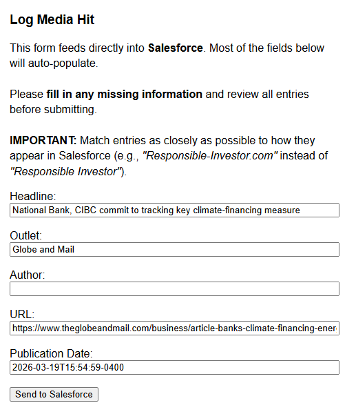

# SHARE Media Logger

A tool for logging media hits to Salesforce, developed by SHARE Communications Manager Adam Burns (aka @torontocaper).

## Purpose

This app is meant to be used internally by staff at [SHARE](https://share.ca), the Shareholder Association for Research and Education, to log news articles and other media hits that are relevant to the organization.

Its current working form involves three separate components:

1. A **bookmarklet** — a piece of Javascript code that the user adds to their browser as a bookmark, then clicks to execute a particular action. In this case, the **bookmarklet** creates and pre-fills a simple web form with basic information from the article (Headline, Author, Outlet, Publication Date and URL).
2. A **zap** — an automation created with [Zapier](https:zapier.com), an online platform for connecting different apps and websites. The **zap** takes in the information from the web form and sends it to Salesforce.

3. Finally, a **custom 'Media' object** in [SHARE's Salesforce database](https://share.lightning.force.com/lightning/page/home)[^1] that contains both the pre-filled information from the bookmarklet (Author, Outlet and Publication Date), and optionally additional relevant details such as topics, related organizations and whether SHARE was quoted directly.

## User Guide

> [!NOTE]
> This User Guide is a work-in-progress. For help using the app, please [contact Adam](mailto:aburns@share.ca) directly.

### Step 1: Add the bookmarklet to your browser

This can be done in much the same way you add a regular **bookmark**. The difference is that, instead of entering a web address like `https://facebook.com` in the URL field, you'll enter a line of code starting with `javascript:`.

> [!TIP]
> 
> For a detailed guide on how to do this in different browsers (e.g. Chrome, Firefox, Safari), check out this article:
> 
> [What are Bookmarklets? How to Use JavaScript to Make a Bookmarklet in Chromium and Firefox](https://www.freecodecamp.org/news/what-are-bookmarklets/)

If you're interested in what else you can do with bookmarklets, there are plenty of resources out there. For now, all you need to do is copy the following (very long!) line of code and paste that into the URL field for a new bookmark[^2]:

```javascript
javascript:(function(){function getDate(){const m=document.querySelector('meta[property="article:published_time"],meta[name="pubdate"],meta[name="date"]');if(m?.content)return%20m.content;const%20t=document.querySelector(%27time[datetime]%27);if(t?.dateTime)return%20t.dateTime;const%20ld=document.querySelector(%27script[type=%22application/ld+json%22]%27);if(ld){try{const%20j=JSON.parse(ld.innerText);if(j.datePublished)return%20j.datePublished;if(Array.isArray(j[%27@graph%27])){const%20d=j[%27@graph%27].find(n=%3En.datePublished);if(d)return%20d.datePublished}}catch(e){}}return%22%22}const%20h=document.querySelector(%27meta[property=%22og:title%22]%27)?.content||document.title;const%20u=window.location.href;const%20oRaw=document.querySelector(%27meta[property=%22og:site_name%22]%27)?.content||window.location.hostname.replace(/^www\./,%27%27);const%20o=oRaw.replace(/^the\s+/i,%27%27);const%20d=getDate();const%20a=document.querySelector(%27meta[name=%22author%22]%27)?.content||%27%27;const%20w=window.open(%27%27,%27%27,%27width=550,height=600%27);w.document.write(`%3Chtml%3E%3Chead%3E%3Ctitle%3ELog%20Media%20Hit%3C/title%3E%3C/head%3E%3Cbody%20style=%22font-family:sans-serif;padding:20px;%22%3E%3Ch3%3ELog%20Media%20Hit%3C/h3%3E%3Cp%20style=%22margin-bottom:1em;line-height:1.4;%22%3EThis%20form%20feeds%20directly%20into%20%3Cstrong%3ESalesforce%3C/strong%3E.%20Most%20of%20the%20fields%20below%20will%20auto-populate.%3Cbr%3E%3Cbr%3EPlease%20%3Cstrong%3Efill%20in%20any%20missing%20information%3C/strong%3E%20and%20review%20all%20entries%20before%20submitting.%3Cbr%3E%3Cbr%3E%3Cstrong%3EIMPORTANT:%3C/strong%3E%20Match%20entries%20as%20closely%20as%20possible%20to%20how%20they%20appear%20in%20Salesforce%20(e.g.,%20%3Cem%3E%22Responsible-Investor.com%22%3C/em%3E%20instead%20of%20%3Cem%3E%22Responsible%20Investor%22%3C/em%3E).%3C/p%3E%3Cform%20method=%22POST%22%20action=%22{{ZAPIER_WEBHOOK_URL}}%22%3E%3Clabel%20title=%22Title%20of%20the%20article%20as%20extracted%20from%20the%20page%22%3EHeadline:%3Cbr%3E%3Cinput%20name=%22headline%22%20value=%22${h.slice(0,80).replace(/%22/g,%27&quot;%27)}%22%20style=%22width:100%%22%20/%3E%3C/label%3E%3Cbr%3E%3Cbr%3E%3Clabel%20title=%22Name%20of%20the%20media%20outlet%20or%20publisher%22%3EOutlet:%3Cbr%3E%3Cinput%20name=%22outlet%22%20value=%22${o.replace(/%22/g,%27&quot;%27)}%22%20style=%22width:100%%22%20/%3E%3C/label%3E%3Cbr%3E%3Cbr%3E%3Clabel%20title=%22Author%20name,%20if%20available%20in%20the%20page%20metadata%22%3EAuthor:%3Cbr%3E%3Cinput%20name=%22author%22%20value=%22${a.replace(/%22/g,%27&quot;%27)}%22%20style=%22width:100%%22%20/%3E%3C/label%3E%3Cbr%3E%3Cbr%3E%3Clabel%20title=%22Full%20URL%20of%20the%20article%22%3EURL:%3Cbr%3E%3Cinput%20name=%22url%22%20value=%22${u.replace(/%22/g,%27&quot;%27)}%22%20style=%22width:100%%22%20/%3E%3C/label%3E%3Cbr%3E%3Cbr%3E%3Clabel%20title=%22Date%20of%20publication,%20if%20detected%22%3EPublication%20Date:%3Cbr%3E%3Cinput%20name=%22publication_date%22%20value=%22${d.replace(/%22/g,%27&quot;%27)}%22%20style=%22width:100%%22%20/%3E%3C/label%3E%3Cbr%3E%3Cbr%3E%3Cbutton%20type=%22submit%22%3ESend%20to%20Salesforce%3C/button%3E%3C/form%3E%3C/body%3E%3C/html%3E`);})();
```

Give your bookmarklet a descriptive, memorable name like `Add media hit to Salesforce`, and keep it in a place where you'll easily be able to find it in the future, such as your main **Bookmarks** bar. 

### Step 2: Fill out the form

When you come across an article you'd like to add to Salesforce, click the **bookmarklet**. The code you pasted earlier will then execute on the currently open page, causing a form to pop up with some pre-filled information.



Make sure that the pre-filled data in the form is accurate, and fill in any empty fields. 

> [!IMPORTANT]
>
> Please pay particular attention to the **Outlet** and **Author** fields; these have to match the corresponding entries in Salesforce in order for the 'zap' to execute properly.
>
> For example, 'Globe and Mail' will work; 'The Globe and Mail' will not.

### Step 3: Check Salesforce for your article

After you click the 'Send to Salesforce' button, the form will disappear. You can now close the pop-up window. 

In a new browser tab (keeping the original article open in its own tab), navigate to Salesforce. On the homepage, click the 'Media' heading. This will display a list of the latest media hits, sorted by publication date.

Look for your headline. If you don't see it immediately, give it a minute or two and refresh the list. If it's still not showing up, it's likely that you encountered one of the **known issues** listed below.

If your headline is there, congrats — and thank you! You've added a media hit to Salesforce, contributing to a valuable tool for SHARE to keep track of coverage and spread our message to new audiences.

### Step 4a (optional): Add additional details

Right now, the 'Media' object you created is pretty basic: it contains only the information from the form you submitted earlier.

This is extremely useful information, but what really allows us to tap into the **power of Salesforce** (shout-out Rosie) is by connecting the article to relevant people and organizations. 

To do this, click on your article headline. On the details page for your article, fill in whatever information you can. The most important fields are 'related organization', 'SHARE-related' and 'SHARE spokesperson', but anything else you can add would be helpful.

### Step 4b (optional): Upload a PDF of your article

This step is only important for articles from outlets that have a 'paywall'. If you have subscriber access, it's very helpful to 'print' a PDF of the article directly from the browser, and upload that file, either to Box or directly to the Media object on Salesforce.

## Known issues

### Difficulty debugging
Because of the nature of the `bookmarklet -> webhook -> Zapier -> Salesforce` data-flow, it's difficult for developers — let alone users! — to know whether logging was successful, and if not, what went wrong.

### Only existing authors/outlets allowed

If the author of the article or the outlet isn't found in Salesforce, the 'zap' will fail without alerting the user. 

## Roadmap

I hope to eventually turn this into a standalone 'web app' or browser extension, to limit the amount of potential points of failure.

## Security notes

Don't publish unedited json exported from Zapier; it exposes the Salesforce API key.

Replace with `SALESFORCE_AUTH`. It's usually the last line in the json file.

Ditto the Zapier webhook URL; replace with `ZAPIER_WEBHOOK_URL` in both `bookmarklet.js` and `bookmarklet.txt`.

(It follows "action": in the "form" html component.)

[^1]: Internal link, accessible only to SHARE staff
[^2]: For security reasons, this code is missing a key piece of information; [contact Adam](mailto:aburns@share.ca) to get the working version.